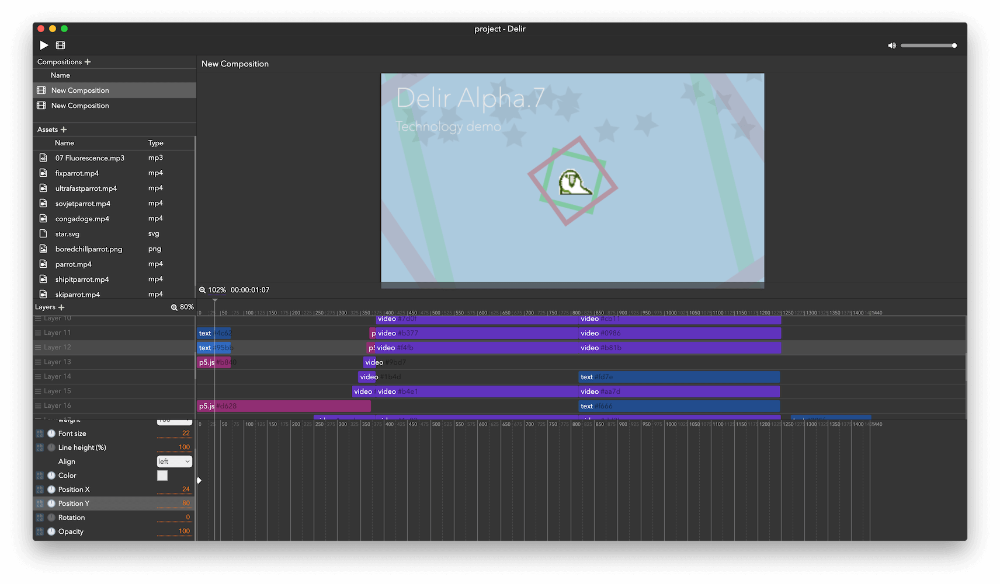

# Delir
Web Technology driven VFX Application.

Runs on Windows, macOS, Linux.



## Concept

- **Movie Production with Programming**
  - First class `p5.js` support for video production
  - Can be make custom post processing plugin with HTML5 Canvas and WebGL
- Standalone engine (`@delirvfx/core`) for makes your VFX app
  - Modern and simple software architecture
- Works on Web technology for rapid development (Fully TypeScript, HTML5, Canvas and WebGL)

## Feature

- Video, Image, Audio, Text and P5.js support
- Adjustment clip
- Keyframe animation editor
  - With Expression support by JavaScript(TypeScript)
- Post processing plugin support with Canvas2DContext and WebGL(experimental, now in develop)
- Rendering to mp4(H.264 + aac) with ffmpeg

## For developer

### How to develop Post processing plugin
See [plugin-example](https://github.com/ra-gg/Delir/tree/master/packages/core/plugin-example)

### Run Delir for development
1. Delir depends to below softwares.
  You must install the above program before starting development.

  - Node.js 10+
    `brew install node`
  - yarn ([yarnpkg/yarn](https://github.com/yarnpkg/yarn))
    `npm i -g yarn`
  - node-gyp
    `npm i -g node-gyp`
  - ffmpeg
    `brew install ffmpeg`

2. Clone this repository
  ```
  git clone git@github.com:ra-gg/delir.git
  ```

3. Install dependency and start development
  ```
  yarn start
  ```

  Ctrl+C to interrupt

#### Production building
Now only building for development machine platform. (mac / win)
Native module can not build for another platform.

```
yarn build
```

### Path to code
- packages
  - **delir**  -- Electron frontend of Delir
    - **domain**  -- Operation / Action / Store / Utils set by domain
      - **Editor**  -- Editor state and actions
      - **Preference**  -- Editor preference state and actions
      - **Project**  -- Project(Document) state and actions
      - **Renderer**  -- Delir engine state and actions
    - **modules**  -- Modal windows
    - **utils**  -- View utilities non relate some domain
    - **views**  -- View components
  - **core**  -- Core module codes called `@delirvfx/core` (Project structure, engine, calculation, renderer)
  - **deream** -- Renderered frame exporter for ffmpeg
  - **plugins** -- Built-in Delir plugins (build with webpack)


## Contributors

### Code Contributors

This project exists thanks to all the people who contribute. [[Contribute](CONTRIBUTING.md)].
<a href="https://github.com/ra-gg/Delir/graphs/contributors"></a>

### Financial Contributors

Become a financial contributor and help us sustain our community. [[Contribute](https://opencollective.com/delirvfx/contribute)]

#### Individuals

<a href="https://opencollective.com/delirvfx"></a>

#### Organizations

Support this project with your organization. Your logo will show up here with a link to your website. [[Contribute](https://opencollective.com/delirvfx/contribute)]

<a href="https://opencollective.com/delirvfx/organization/0/website"></a>
<a href="https://opencollective.com/delirvfx/organization/1/website"></a>
<a href="https://opencollective.com/delirvfx/organization/2/website"></a>
<a href="https://opencollective.com/delirvfx/organization/3/website"></a>
<a href="https://opencollective.com/delirvfx/organization/4/website"></a>
<a href="https://opencollective.com/delirvfx/organization/5/website"></a>
<a href="https://opencollective.com/delirvfx/organization/6/website"></a>
<a href="https://opencollective.com/delirvfx/organization/7/website"></a>
<a href="https://opencollective.com/delirvfx/organization/8/website"></a>
<a href="https://opencollective.com/delirvfx/organization/9/website"></a>
